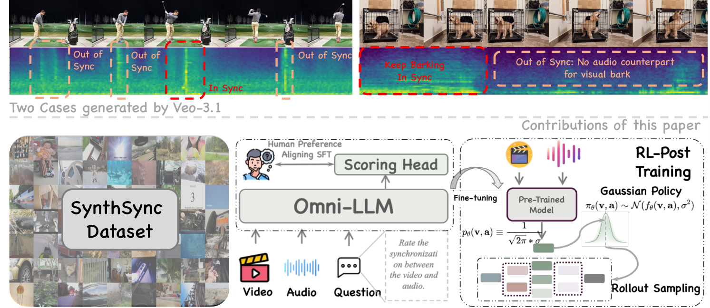
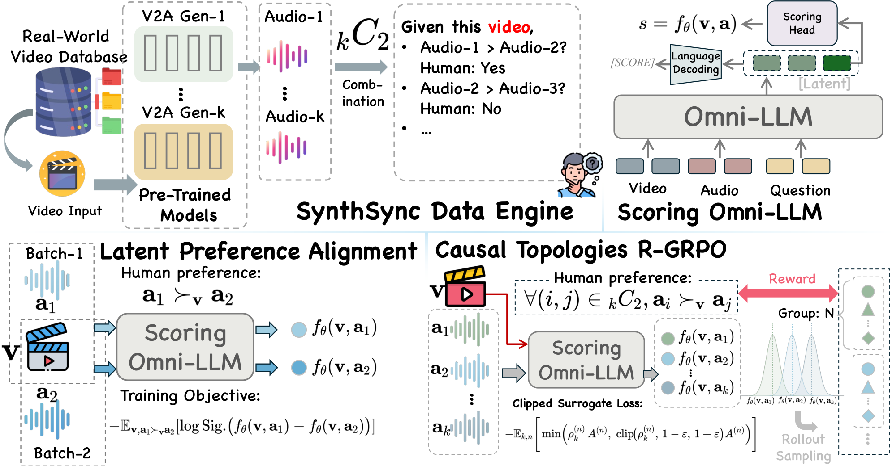
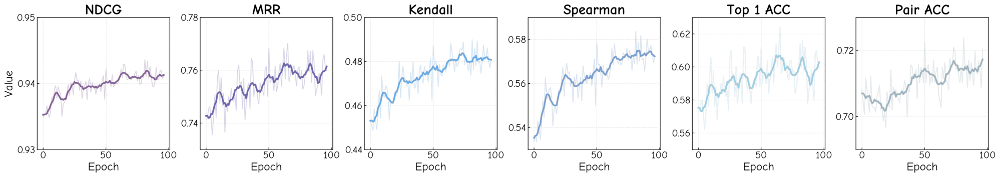
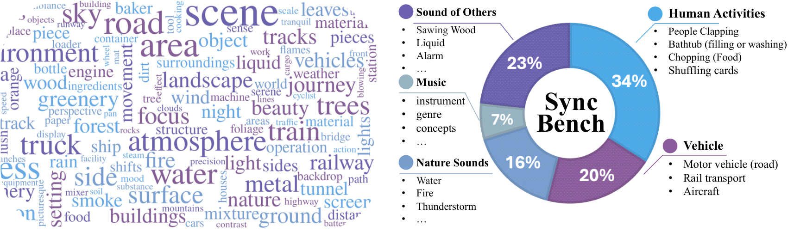
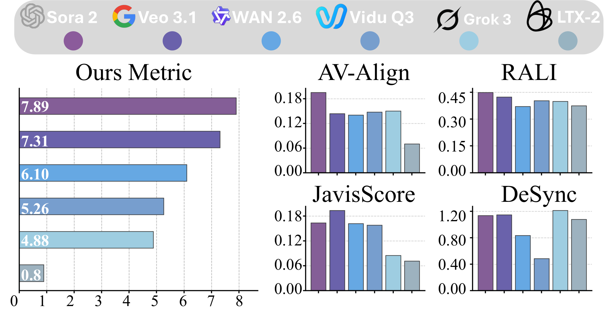
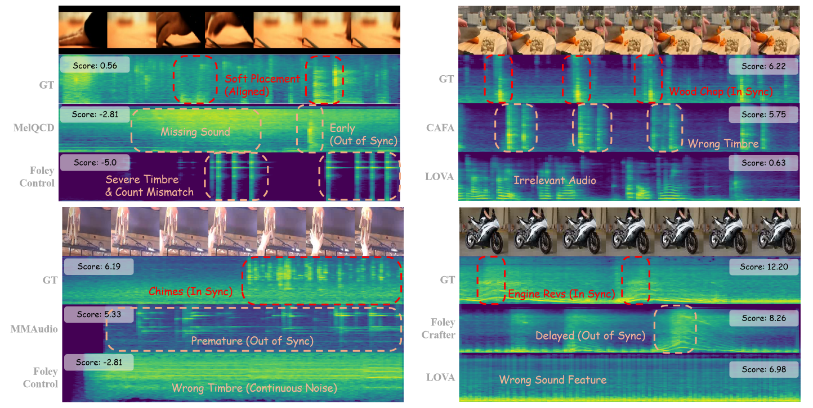

<div align="center">

<h1>AV-Sync Evaluator</h1>

<p><strong>🎬 Beyond Time Shifts: A Reference-Free Evaluator for Generative Audio-Visual Models</strong></p>

<p>A reference-free audio-visual synchronization metric on Qwen2.5-Omni-3B. One video clip in → one scalar out (higher = better synced). Official code for our ECCV 2026 paper, with the full training recipe and inference stack.</p>

<p>
  <a href="#-quick-start"><b>🚀 Quick Start</b></a> |
  <a href="#-method"><b>🧠 Method</b></a> |
  <a href="#-evaluation"><b>📊 Evaluation</b></a> |
  <a href="#-training"><b>🔧 Training</b></a> |
  <a href="#-use-your-own-dataset"><b>📁 Custom Data</b></a> |
  <a href="#-roadmap"><b>🧭 Roadmap</b></a> |
  <a href="#-citation"><b>📝 Citation</b></a>
</p>

<p>
  
  
  
  
  
</p>



</div>

## 🔥 News

- **[2026-07]** 🎉 Code released — inference/evaluation + full two-stage training pipeline.
- **[2026-07]** 📄 Paper accepted to **ECCV 2026**.
- **[coming soon]** 📦 SynthSync dataset & trained checkpoint. Until then, run on your [own dataset](#-use-your-own-dataset).

## ✨ Introduction

Generative audio-visual models fail synchronization in ways classic metrics can't
catch — *structural hallucinations*, *asymmetric cross-modal relations*, and
*temporally diffuse events* — not the simple time shifts those metrics assume.
Humans judge such failures by **relative comparison**, yet a deployable metric must
be **reference-free and absolute**. We resolve this with a three-part recipe:

1. **SynthSync** — the first dataset of *authentic* generative sync failures: 10 V2A models generate competing audios per video, with ≈306K pairwise human annotations.
2. **Continuous Omni-LLM evaluator** — Qwen2.5-Omni-3B with a `[SCORE]`-token projection head replacing the language head, giving one reference-free scalar.
3. **R-GRPO** — RL post-training that treats the scalar as a Gaussian policy and optimizes the whole *listwise* score distribution, internalizing global causal structure.

The resulting metric powers **SyncBench**, our leaderboard for AV-generation models.

> Self-contained: bundles the Qwen2.5-Omni / Qwen2-VL code; only `transformers` needed for tokenizer/config.

## 📊 Results

New state of the art on SynthSync, over off-the-shelf Omni-LLMs, non-LLM metrics, and trained LLM evaluators:

| Metric | PFT baseline | **+ R-GRPO** |
|--------|:---:|:---:|
| NDCG | 0.9353 | **0.9435** |
| Kendall's τ | 0.4515 | **0.4899** |
| MRR | 0.7316 | **0.7674** |
| Pairwise Acc (%) | 71.16 | **72.38** |

<sub>Ablation (NDCG / Pair-Acc): base 0.8531 / 51.02 → +SynthSync 0.9224 / 66.60 → +SFT 0.9353 / 71.16 → +R-GRPO **0.9435 / 72.38**.</sub>

## 🚀 Quick Start

```bash
pip install -r requirements.txt

# Convert the trained DeepSpeed checkpoint to a single .pt (once)
python convert_checkpoint.py --ckpt_dir /path/to/best-epoch081.ckpt --out ./avsync_eval_weights.pt

# Score one clip
python demo_single_video.py --weights ./avsync_eval_weights.pt --video /path/to/clip.mp4
# -> Sync score for /path/to/clip.mp4: 3.14
```

`transformers==4.57.1`, `qwen-omni-utils==0.0.8`; base weights download from the HF
Hub on first run. For training: `pip install -r requirements_train.txt`.

`convert_checkpoint.py` keeps only the `transformer.*` / `regression_head.*` tensors
from the ZeRO dir — `zero_to_fp32.py` is not needed.

## 🧠 Method

<div align="center">

</div>

Qwen2.5-Omni-3B with a continuous MLP head reading the hidden state at a `[SCORE]`
token: `s = MLP(h_score)`. Trained in two stages:

- **Stage I — Preference SFT.** Bradley-Terry-Luce loss over pairwise preferences (no MSE regression), inducing a globally consistent reference-free scale. A **dynamic curriculum** anneals from easy (high-margin) to hard pairs.
- **Stage II — R-GRPO.** Reparameterize the scalar `μ_θ` as a Gaussian policy, sample listwise rollouts per video, and reward each by its full-ranking match to ground truth (NDCG / Kendall / Spearman / Top-1 / MRR / pairwise). Group-relative advantages + closed-form Gaussian ratio + PPO clip + KL penalty.

<div align="center">

</div>

### 🏆 SyncBench

We rank six AV-generation models (Sora-2, Veo-3.1, WAN-2.6, Vidu-Q3, Grok-3, LTX-2)
on 185 prompts. Legacy metrics (AV-Align, JavisScore, DeSync) give volatile,
contradictory rankings; ours stratifies model quality cleanly.

<div align="center">

<br><br>

</div>

### 🔍 Qualitative examples

<div align="center">

<br><sub>Our metric penalizes missing events, mistimed responses, timbre mismatch, and event-count errors — not low-level signal similarity.</sub>
</div>

## 📊 Evaluation

```bash
python evaluate.py --weights ./avsync_eval_weights.pt --data_root /path/to/data --batch_size 3
```

Reports pairwise accuracy (with easy/medium/hard breakdown), correlation, and MAE;
writes predictions to `eval_results.json`.

| Flag | Default | Notes |
|------|---------|-------|
| `--precision_mode` | `bf16` | `bf16-mixed` = training autocast path |
| `--attn_implementation` | `sdpa` | `flash_attention_2` = training kernel |
| `--batch_size` | `3` | lower to `1` if memory-constrained |

### Batch scoring (no labels)

```bash
# Flat directory of clips: per-clip scores + per-model mean/median
python score_videogen.py --weights ./avsync_eval_weights.pt --root /path/to/outputs --out ./scores.json

# LTX nested layout ( <sample_id>/video_*.mp4 )
python score_ltx.py --weights ./avsync_eval_weights.pt --root /path/to/LTX --out ./ltx_scores.json
```

### Programmatic use

```python
import torch
from avsync_eval.models.evaluator import AVSyncEvaluator

model = AVSyncEvaluator(model_name="Qwen/Qwen2.5-Omni-3B", v_fps=12, v_size=140)
ckpt = torch.load("avsync_eval_weights.pt", map_location="cpu")
model.load_eval_checkpoint(ckpt["state_dict"])
model.to_eval_device()                          # -> cuda, bf16, eval()

scores = model.score_batch([video_tensor], [audio_array])   # list[float]
```

`video_tensor`: `(frames, 3, H, W)`; `audio_array`: 1-D 16 kHz waveform. Decode mp4s
with `qwen_omni_utils.process_mm_info(..., use_audio_in_video=True)` (see
`demo_single_video.py:load_clip`).

## 🔧 Training

Two stages via `train.py`, selected by `--train_mode`. Only the LLM layers and the
score head are trained (encoders/embeddings frozen); a frozen reference copy serves
the RL objectives. Checkpoints trained here convert and evaluate identically.

| Mode | Objective | Data / item |
|------|-----------|:-----------:|
| `SFT` | CE on `SCORE` token + Bradley-Terry pairwise | 1 pair |
| `RL` | Pairwise GRPO | 1 pair |
| `RL_rank` | Listwise GRPO (global ranking reward) | *K* methods |

```bash
# Stage 1 — SFT cold start
python train.py --train_mode SFT --data_root /path/to/data --exp_dir ./runs/sft --devices 6

# Stage 2 — listwise RL from the SFT checkpoint (convert it to .pt first)
python train.py --train_mode RL_rank --data_root /path/to/data \
    --pretrained ./sft_weights.pt --sample_list_path /path/to/data/train.txt \
    --num_methods 6 --exp_dir ./runs/rl_rank --devices 6
```

- **Dynamic curriculum** (SFT/RL): advances easy→hard when accuracy exceeds `--curriculum_threshold` (0.88). `RL_rank` has no curriculum.
- **Key flags**: `--num_methods` (K per sample, bounds VRAM), `--manual_std` / `--num_rollout` / `--epison` / `--kl_weight` (GRPO), `--batch_size` (auto: 1 for RL_rank, 8 else). `python train.py --help` for all.
- **VRAM (RL_rank, bs=1)**: ~4–5 methods @ 24 GB · ~6–8 @ 40 GB · 11 @ 80 GB.

### 📁 Use your own dataset

> **SynthSync isn't released yet** ([Roadmap](#-roadmap)) — but the code runs on **any custom dataset**.

```
my_dataset/
├── overall_scores.json                 # {sample: {method: gt_score}}      [required]
├── valing_pairs.json                   # eval / validation pairs           [eval + val]
├── train.txt                           # sample names, one per line        [RL_rank]
├── curriculumn_SFT/level_{0..9}.json   # curriculum pairs — SFT            [SFT only]
├── curriculumn_RL/level_{0..9}.json    # curriculum pairs — pairwise RL    [RL only]
└── <method>/<sample_name>.mp4          # one clip per (method, sample)     [required]
```

Each *sample* is a video; each *method* is an audio source (a V2A model, or `GT_A`).
Audio is read from the video track. Evaluation-only needs just `overall_scores.json`,
`valing_pairs.json`, and the mp4s.

📖 Full JSON schemas, per-mode files, and the custom method-name note:
[`docs/CUSTOM_DATASET.md`](docs/CUSTOM_DATASET.md).

## 📂 Repository Layout

```text
opensource_eval/
├── convert_checkpoint.py       # DeepSpeed ZeRO ckpt -> single .pt
├── evaluate.py                 # dataset eval -> pairwise accuracy
├── demo_single_video.py        # score one mp4
├── score_videogen.py           # batch-score a flat dir (no GT)
├── score_ltx.py                # batch-score LTX nested layout (no GT)
├── train.py                    # training entry (SFT / RL / RL_rank)
├── requirements*.txt           # inference / + training deps
└── avsync_eval/
    ├── models/                 # evaluator.py, hacked_qwen.py
    ├── data/dataset.py         # AV_ValDataset
    ├── training/               # module.py, train_dataset.py, ranking_reward.py
    ├── metrics.py              # pairwise ranking accuracy
    ├── qwen2_5_omni/           # bundled Qwen2.5-Omni
    └── qwen2_vl/               # bundled Qwen2-VL
```

## 🔁 Reproducibility

`fps=12`, `140×140` (5 s → 60 frames), audio 80 000 samples, bf16 — the defaults
everywhere; use `--precision_mode bf16-mixed` to match the training autocast path.
Training and inference share the same model/head/forward, so `train.py` outputs
evaluate identically through `evaluate.py`.

## 🧭 Roadmap

- [x] Inference / evaluation package
- [x] Full training pipeline (preference SFT + R-GRPO)
- [x] Batch scorers for unlabeled outputs
- [ ] **SynthSync dataset** *(in preparation)*
- [ ] **Trained checkpoint** on the HF Hub *(in preparation)*
- [ ] **SyncBench** prompts & samples

## 📝 Citation

```bibtex
@inproceedings{qian2026beyond,
  title     = {Beyond Time Shifts: Adapting Omni-LLM as a Reference-Free
               Evaluator for Generative Audio-Visual Models},
  author    = {Qian, Yijie and Wang, Juncheng and Xu, Chao and Wang, Huihan and
               Feng, Yuxiang and Liu, Yang and Sun, Baigui and Liu, Yong and
               Wang, Shujun},
  booktitle = {European Conference on Computer Vision (ECCV)},
  year      = {2026}
}
```

## 🙏 Acknowledgments

Built on [Qwen2.5-Omni](https://github.com/QwenLM/Qwen2.5-Omni);
trained with [PyTorch Lightning](https://github.com/Lightning-AI/pytorch-lightning)
+ [DeepSpeed](https://github.com/deepspeedai/DeepSpeed);
R-GRPO adapts [GRPO](https://github.com/deepseek-ai/DeepSeek-R1) to continuous policies.

## 📄 License

[MIT](LICENSE). Qwen2.5-Omni base weights follow their provider's license.
